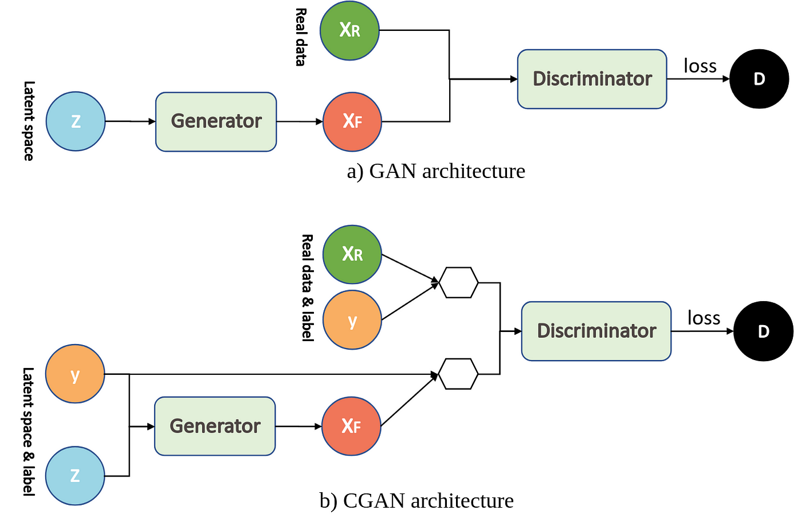

# TP 4: cGAN

## Description

Comme vous avez pu le voir dans la forma GAN, les GAN c'est super, mais ça a plein de problèmes. Notamment, il est possible qu'il se mette à générer que des images très similaires - c'est le problème du mode collapse. Un autre "problème", c'est qu'on a aucun contrôle sur l'output : on ne peut pas lui préciser ce qu'on veut lui faire générer ce qu'on veut une fois qu'il a été entrainé.
Mais ne perdez pas espoir, il existe une super solution à ces problèmes : labéliser les données. Et bien, un CGAN c'est exactement ça, un GAN avec des labels.
