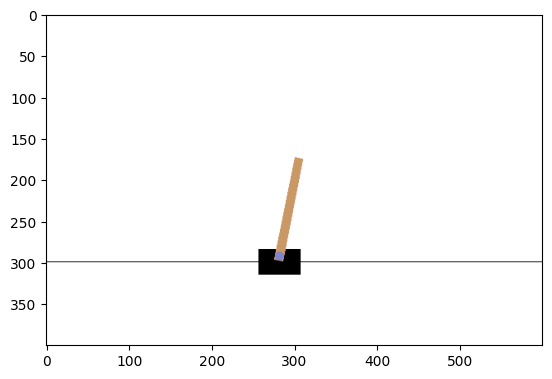

# TP 1: Introduction RL

## Description
Ce tutoriel montre comment utiliser PyTorch pour entraîner un agent Deep Q Learning (DQN) sur CartPole-v1 de Gymnasium. Ce tutoriel est largement inspiré de la documention torch : https://pytorch.org/tutorials/intermediate/reinforcement_q_learning.html.

**Tâche** : L'agent doit décider entre deux actions : déplacer le chariot vers la gauche ou vers la droite - afin que le poteau qui lui est attaché reste en équilibre. Vous pouvez trouver plus d'informations sur l'environnement et sur d'autres environnements plus difficiles sur le site web de Gymnasium.
