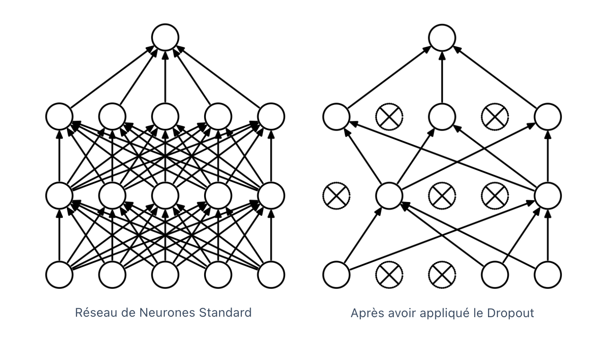

# TP 4: Data Augmentation

## Description
Si vous avez suivi les TPs automatants, vous avez sûrement du remarquer que, pour entraîner un modèle d'IA, 
on a besoin de beaucoup de données. Or, on n'a parfois qu'un nombre limité de données à notre disposition donc il peut être nécessaire d'augmenter artificiellement celui ci, 
c'est la data augmentation. Le principe est d'appliquer des transformations à nos données pour en créer de nouvelles.

Dans ce TP, nous allons utiliser le dataset [CIFAR-10](https://www.cs.toronto.edu/~kriz/cifar.html) constitué de 
60 000 images. Dans ce TP, on présente deux transformations de base de pytorch : 
`RandomResizedCrop` récupère une partie aléatoire de l'image tout en conservant la taille initiale et 
`RandomHorizontalFlip` tourne l'image horizontalement. Libre à vous de tester d'autre transformations.
